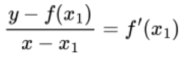

# Numerical Integral Evaluator

C++ code to solve integrals via the basic definition of a definite integral.

## Mathematical Prerequisites
1. The function must be **continuous** and **bounded** between the limits specified.
2. The function must have defined values for the upper and lower limits.

## How does it work?
* We start Newton's Method with an initial guess, $x_1$. Initially, $f(x_1) \neq 0$ since it's just a guess. However, this guess helps us find the derivative of the function at that point, enabling us to draw a tangent.

* We draw a tangent at the point $x_1$, and observe that when extended to intersect the x-axis at $x_2$, it's closer to the actual root than our previous guess. This implies that $x_2$ is a better guess. We repeat this process, taking $x_2$ as the new guess, which gives us a tangent intersecting the x-axis at $x_3$, even closer to the root than $x_2$. This iteration continues until we reach $f(x_i) = 0$ or get close enough to it (adjustable with the tolerance).

Mathematically, the equation of the tangent line at $x_1$ is given by:

Since we're interested in finding the root where $y = 0$, we rearrange this equation to solve for $x$, resulting in:

This formula updates our guess, and we iterate until convergence.
For any general iteration i, this can be said to be - 

\end{document}

## How to run it?
1. The file is in C++. It requires you to have the GNU C++ compiler (doesn't need to be GNU, but it's tested on GNU) so that it can be turned into an executable for your computer to run.
2. Assuming you already have GNU, open up your terminal of choice and put in the command `g++ newton.cpp` in the directory where you've saved the file. (You can use the `cd` command to navigate through your directories.)
3. Assuming the last step went smoothly and without errors (which it should), you need to type in `./a.out (function) (upper_bound) (lower_bound) --increment (increment_steps_value) --simpson --trapezoid`.

## Supported Functions?

* sin(x)
* cos(x)
* tan(x)
* cosec(x)
* sec(x)
* cot(x)
* asin(x)
* acos(x)
* atan(x)
* sinh(x)
* cosh(x)
* tanh(x)
* asinh(x)
* acosh(x)
* atanh(x)
* log(x)
* ln(x)
* log(base)(x)
* gamma(x)
* lgamma(x)
* exp(x)
* sqrt(x)
* exp2(x)
* exp10(x)
* cbrt(x)
* abs(x)
* sgn(x)
